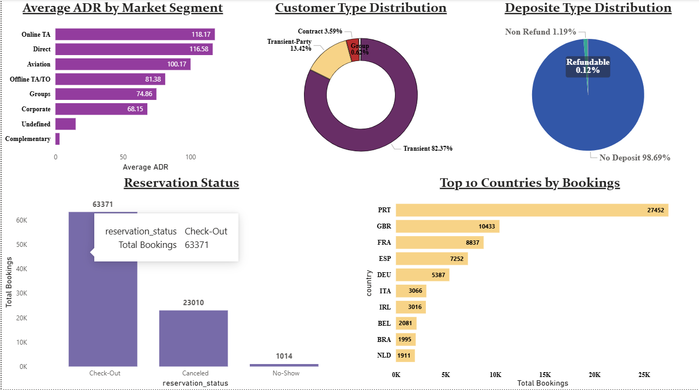

# 🏨 Hotel Booking Analytics Project

A complete end-to-end Data Analytics project that analyzes hotel booking data to uncover booking trends, customer behavior, cancellation patterns, and pricing insights. The project also includes a Machine Learning model to predict booking cancellations and an interactive Power BI dashboard for business decision-making.

---

## 📌 Project Overview

This project focuses on analyzing hotel booking data collected from City Hotels and Resort Hotels. The workflow covers the complete data analytics lifecycle:

- Data Cleaning & Preprocessing
- Exploratory Data Analysis (EDA)
- Feature Engineering
- Machine Learning Model Development
- Interactive Power BI Dashboard

The primary objective is to help hotel management understand customer behavior, reduce booking cancellations, and optimize pricing strategies.

---

## 🎯 Objectives

- Analyze booking patterns across different hotels.
- Identify factors influencing booking cancellations.
- Understand customer demographics and booking behavior.
- Predict booking cancellations using Machine Learning.
- Develop an interactive dashboard for business insights.

---

## 📂 Dataset

**Source:** Kaggle - Hotel Booking Demand Dataset

The dataset contains booking information for both City Hotel and Resort Hotel, including:

- Hotel Type
- Lead Time
- Arrival Date
- Customer Type
- Market Segment
- Deposit Type
- Average Daily Rate (ADR)
- Reservation Status
- Country
- Booking Cancellation Status
- Special Requests
- Parking Requirements
- Guest Information

---

## 🛠️ Tools & Technologies

- Python
- Pandas
- NumPy
- Matplotlib
- Seaborn
- Scikit-learn
- Jupyter Notebook
- Power BI
- Git
- GitHub

---

# 📁 Project Structure

```
hospitality_analytics_project/
│
├── data/
│   ├── raw/
│   └── cleaned/
│       └── hotel_bookings_cleaned.csv
│
├── notebooks/
│   ├── 01_data_cleaning.ipynb
│   ├── 02_eda.ipynb
│   ├── 03_machine_learning.ipynb
│   └── 04_powerbi.ipynb
│
├── reports/
│   ├── adr_summary.csv
│   ├── cancellation_summary.csv
│   ├── country_summary.csv
│   ├── customer_summary.csv
│   ├── feature_importance.csv
│   ├── market_summary.csv
│   └── model_comparison.csv
│
├── powerbi/
│   └── hotel_booking_dashboard.pbix
│
├── screenshots/
│   ├── week1/
│   ├── week2/
│   ├── week3/
│   └── week4/
│
├── .gitignore
└── README.md
```

---

# 📅 Project Workflow

## ✅ Week 1 – Data Cleaning

- Imported hotel booking dataset
- Handled missing values
- Removed duplicate records
- Detected and treated outliers
- Feature creation:
  - Total Stay
  - Total Guests
  - Family Indicator
- Saved cleaned dataset

---

## ✅ Week 2 – Exploratory Data Analysis

Performed detailed analysis on:

- Hotel Booking Distribution
- Customer Types
- Market Segments
- Average Daily Rate (ADR)
- Monthly Booking Trends
- Cancellation Analysis
- Reservation Status
- Country-wise Bookings
- Deposit Type Distribution
- Special Requests Analysis

Generated summary reports and visualizations.

---

## ✅ Week 3 – Machine Learning

### Feature Engineering

- One-Hot Encoding
- Train-Test Split
- Target Variable Preparation

### Models Trained

- Logistic Regression
- Decision Tree
- Random Forest

### Evaluation Metrics

- Accuracy
- Precision
- Recall
- F1 Score
- ROC Curve
- Confusion Matrix

### Best Model

**Random Forest Classifier**

Performance:

| Metric | Score |
|---------|-------|
| Accuracy | 84.78% |
| Precision | 77.81% |
| Recall | 62.46% |
| F1 Score | 69.29% |
| ROC AUC | 0.905 |

Top Important Features:

- Lead Time
- ADR
- Arrival Date
- Special Requests
- Total Stay
- Agent
- Country
- Booking Changes

---

## ✅ Week 4 – Power BI Dashboard

Developed a two-page interactive dashboard.

### Executive Dashboard

- Total Bookings
- Cancellation Rate
- Average ADR
- Average Stay
- Average Lead Time
- Total Guests
- Monthly Booking Trend
- Cancellation Rate by Hotel

### Business Insights

- Average ADR by Market Segment
- Customer Type Distribution
- Deposit Type Distribution
- Reservation Status
- Top 10 Countries by Bookings

Interactive Filters:

- Hotel
- Arrival Year
- Customer Type
- Market Segment
- Country

---

# 📊 Dashboard Preview

## Executive Dashboard

>

---

## Business Insights Dashboard

>

---

# 📈 Key Business Insights

- City Hotels have a higher cancellation rate than Resort Hotels.
- Online Travel Agencies generate the highest number of bookings.
- Longer lead times are strongly associated with booking cancellations.
- Most customers prefer "No Deposit" reservations.
- Portugal contributes the highest number of hotel bookings.
- Transient customers account for the majority of bookings.
- ADR varies significantly across market segments.

---

# 📌 Skills Demonstrated

- Data Cleaning
- Data Preprocessing
- Exploratory Data Analysis
- Data Visualization
- Feature Engineering
- Machine Learning
- Model Evaluation
- Business Intelligence
- Dashboard Design
- Git & GitHub Version Control

---

# 👨‍💻 Author

**Dipanjan Ghosh**

# Tools Used

Python | SQL | Power BI | Machine Learning

GitHub:
https://github.com/ghosh512005-commits

LinkedIn:
*www.linkedin.com/in/dipanjan-ghosh-7174433570*

---